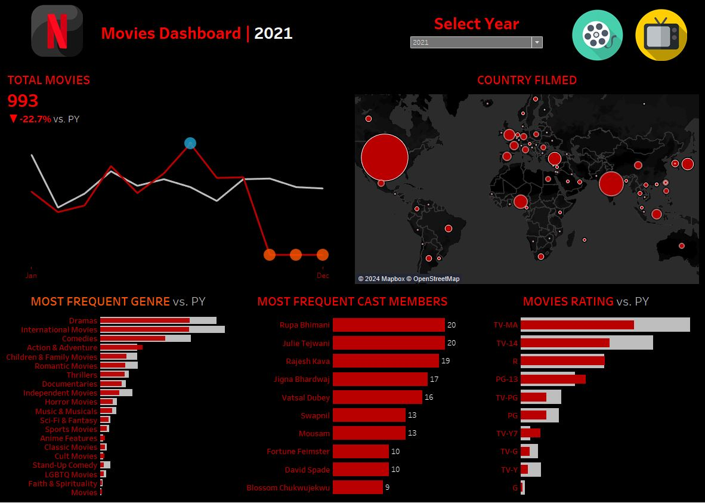

# 🎬 Netflix Infographic
Welcome to the Netflix Infographic project! 🎉 This is a dynamic data viz project where you can dive into Netflix movies and TV shows, exploring everything from countries filmed to release dates, genres, ratings, frequent cast members, and directors. Get ready to explore the world of Netflix in a whole new way! 🌍🍿

This repo contains the Tableau file **and** a [preprocessing Python notebook](preprocessing.ipynb) to prep the data before the magic happens.

## 📊 Dataset
The original dataset has 12 columns and 8,807 rows of juicy Netflix info—each row representing either a movie or a TV show. You’ll find details like:
- `show_id`
- `type`
- `title`
- `director`
- `cast`
- `country`
- `date_added`
- `release_year`
- `rating`
- `duration`
- `listed_in` (genre)
- `description`

## 🛠 Preprocessing

### Genre Cleanup
In the original dataset, each movie or show has multiple genres squished into one cell. To fix this, I exploded (boom! 💥) the `Genre` column, splitting it into separate rows. Now we can easily count how often each genre appears by grouping by `Genre` with unique `Title`.

### Cast Cleanup
The same issue applied to the `Cast` column—multiple actors/actresses jammed into one cell. So, just like with genres, I exploded the `Cast` column into separate rows. Now, it's easy peasy to find the top actors and actresses! 🎭

## 📈 Visualizations

### Interactive Dashboards
This project includes some pretty cool interactive Tableau dashboards, like:
- **Total Movie KPI**: Sparkline showing the total movies and how they stack up against previous years.
- **Country Filmed**: A map 🌍 visualizing where movies and TV shows were filmed. 
- **Most Frequent Genres**: Bar charts breaking down the most popular genres each year.
- **Top 10 Cast Members**: Bar charts showcasing the top 10 cast members with the most appearances.
- **Movie Rating**: Bar charts analyzing the movie ratings.

### Parameters
There's a "Select Year" parameter, which lets you switch between years dynamically! You can compare current year (CY) sales with previous year (PY) sales. 📅✨

### Calculated Fields
**Movies Dashboard**:
1. **CY Movies**: Calculates distinct movie count for the selected year.
2. **PY Movies**: Calculates distinct movie count for the previous year.
3. **% Diff Movies**: Percentage difference in movie count between the current and previous year.
4. **Min/Max Movies**: Uses window functions to find min and max movie counts.

**TV Shows Dashboard**:
1. **CY TV Shows**: Calculates distinct TV show count for the selected year.
2. **PY TV Shows**: Calculates distinct TV show count for the previous year.
3. **% Diff TV Shows**: Percentage difference in TV show count between the current and previous year.
4. **Min/Max TV Shows**: Uses window functions to find min and max TV show counts.

## 🙏 Acknowledgments
This project uses Airbnb data sourced from [Kaggle](https://www.kaggle.com/datasets/shivamb/netflix-shows).

## 📸 Screenshots

